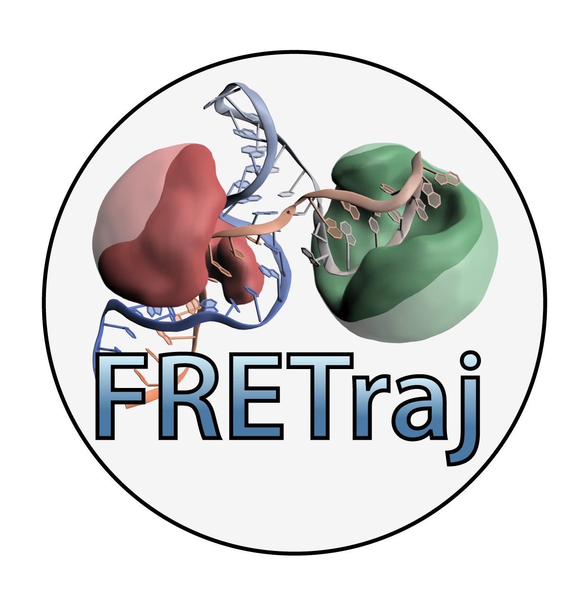
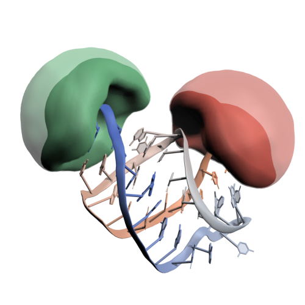

# FRETraj

## What is FRETraj?
FRETraj is a high-level Python API to the **LabelLib** library (https://github.com/Fluorescence-Tools/LabelLib) to simulate fluorophores which are coupled to a biomolecule of interest. The package features a user-friendly **PyMOL plugin** which can be used to explore different labeling positions while designing new FRET experiments. In an AV simulation the fluorophore distribution is estimated by shortest path search (Djikstra algorithm) using a coarse-grained dye probe. FRETraj further implements a **Python-only** version of the geometrical clash search used in LabelLib. This is particularly useful for trying out new features to improve the description of the dye distribution.  


     
A recent addition to the original AV model (Kalinin et al. *Nat. Methods*, 2012) is the so-called **contact volume** (Steffen et. al. *PCCP* 2016). Here, the accessible volume is split into a free volume (FV, transparent) where the dye is freely diffusing and a contact volume (CV, opaque) where the dye stacks to the biomolecular surface. Time-resolved anisotropy experiments suggest that certain fluorophores, among those the commonly used cyanine fluorophores Cy3 and Cy5, are particularly prone to interact with both proteins and nucleic acids. The contact volume accounts for this effect by reweighting the point-cloud. By choosing different experimental weights for the free and contact component the AV dye model is refined, making *in silico* FRET predictions more reliable.

## Installation

FRETraj can be installed platform independently as a Python module or as a Plugin to PyMOL. If you would like to predict FRET efficiencies from a single PDB file (including multiple states), then the PyMOL Plugin provides you with the easiest and fastest access to FRETraj. If you like to integrate FRETraj in your Python analysis workflow (e.g. to calculate multiple accessible volumes along an MD trajectory), then install FRETraj as a module.

### PyMOL plugin

You can get the latest version of PyMOL from [Schrödinger](https://pymol.org/). Start the **Anaconda prompt** which comes bundled with PyMOL 2.x and install the necessary dependencies:
```
conda install numpy "numba<=0.44" mdtraj packaging -c conda-forge
```
For a faster calculation of the AVs you may additionally install LabelLib, but this is not required as FRETraj also runs its own implementation of the AV algorithm.
```
conda install -c tpeulen labellib
or 
pip install git+https://github.com/fdsteffen/labellib.git@src-neighbour-nodes
```

> **Note:** On Windows make sure you have *tqdm* installed otherwise *conda* might throw a error. In case, install it with pip `pip install tqdm`.

To use the **FRETraj PyMOL plugin** simply download the .zip archive from Github and install it via PyMOL's Plugin manager: `Plugin` &rarr; `Plugin manager` &rarr; `Install New Plugin` &rarr; `Choose file...` and select the .zip archive. Upon first startup FRETraj will prompt you to select a root directory where to store the calculated ACVs and parameter files.

 

### Python module

You may install the latest development version of FRETraj as a Python module from Github using pip

```
pip install -e git+https://github.com/fdsteffen/fretraj.git
```

## Bug reports
Please report any *bugs* via the [issue tracker](https://github.com/fdsteffen/fretraj/issues)

## References
- F.D. Steffen, R.K.O. Sigel, R. Börner, *Phys. Chem. Chem. Phys.* **2016**, *18*, 29045-29055. [](https://doi.org/10.1039/C6CP04277E)
- S. Kalinin, T. Peulen, C.A.M. Seidel et al. *Nat. Methods*, **2012**, *9*, 1218-1225. [](https://doi.org/10.1038/nmeth.2222)

