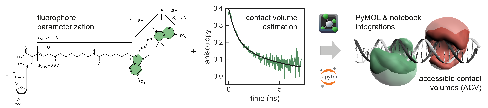

# 

*FRETraj* is a Python module for calculating **multiple accessible-contact volumes** (multi-ACV) and predicting **FRET efficiencies**. It provides an interface to the [*LabelLib*](https://github.com/Fluorescence-Tools/LabelLib) library to simulate fluorophore dynamics. The package features a user-friendly **PyMOL plugin**[1](#pymol) which can be used to explore different labeling positions when designing FRET experiments. In an AV simulation the fluorophore distribution is estimated by a shortest path search (Djikstra algorithm) using a coarse-grained dye probe. *FRETraj* further implements a **Python-only** version of the geometrical clash search used in *LabelLib*. This should facilitate prototyping of new features for the ACV algorithm.

     
A recent addition to the original AV model (Kalinin et al. *Nat. Methods*, 2012) is the so-called **contact volume** (Steffen et. al. *PCCP* 2016). Here, the accessible volume is split into a free volume (FV, transparent) where the dye is freely diffusing and a contact volume (CV, opaque) where the dye stacks to the biomolecular surface. Time-resolved anisotropy experiments suggest that certain fluorophores, among those the commonly used cyanine fluorophores Cy3 and Cy5, are particularly prone to interact with both proteins and nucleic acids. The contact volume accounts for this effect by reweighting the point-cloud. By choosing different experimental weights for the free and contact component the AV dye model is refined, making *in silico* FRET predictions more reliable.

## Installation
Follow the instructions for your platform [here](https://fdsteffen.github.io/fretraj/getting_started/installation)

## References
If you use **FRETraj** in your work please refer to the following paper:
- F.D. Steffen, R.K.O. Sigel, R. Börner, *Phys. Chem. Chem. Phys.* **2016**, *18*, 29045-29055. 

Here, we introduce the contact volume (CV) as an extension of the accessible volume (AV).

### Related projects
The accessible volume is described in:
- S. Kalinin, T. Peulen, C.A.M. Seidel et al. *Nat. Methods*, **2012**, *9*, 1218-1225. 

Fast-NPS (nano-positioning system) uses a Bayesian model to locate a dye with respect to a biomolecule: 
- T. Eilert, M. Beckers, F. Drechsler, J. Michaelis, *Comput. Phys. Commun.*, **2017**, *219*, 377–389. 

Various dye models have been reviewed in:
- M. Dimura, T. Peulen, C.A.M. Seidel et al. *Curr. Opin. Struct. Biol.* **2016**, *40*, 163-185. 
- T. Peulen, O. Opanasyuk, C.A.M Seidel, *J. Phys. Chem . B.*, **2017**, *121*, 8211-8241.

A recent benchmark for FRET-assisted modeling of proteins is described in:
- M. Dimura, T. Peulen, C.A.M Seidel et al. *Nat. Commun.* **2020**, *11*, 5394.

---

<a name="pymol">1</a> PyMOL is a trademark of Schrödinger, LLC.
