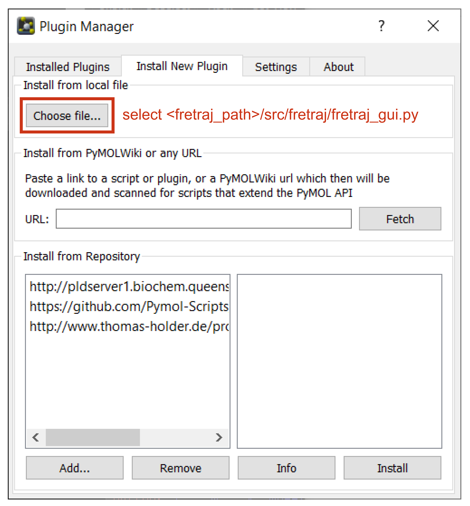

# Installation

There are two main ways of interacting with *FRETraj*:
1. as a [PyMOL](https://pymol.org/) plugin with a GUI
2. as a Python module in a [Jupyter](https://jupyter.org/) notebook


## 1. PyMOL plugin
Depending on your operating system and preference there are multiple options to install PyMOL
- install PyMOL and add *FRETraj* as a Plugin manually &rarr; [Install PyMOL and FRETraj](#install-manually)
- install a Docker image with PyMOL and *FRETraj* preconfigured (see Docker image) &rarr; [Install with Docker](#install-docker)


### 1.1 Install PyMOL and FRETraj
<a name="install-manually"></a>

:::: {.panel-tabset}

#### For Windows
- Get PyMOL from [Schrödinger](https://pymol.org/) or follow the instructions [here](https://pymolwiki.org/index.php/Windows_Install).
- Search for **Anaconda/Miniforge prompt** in the Windows start menu and run the following command to install *FRETraj*

    ```
    conda install fretraj -c conda-forge
    ```
- Locate the installation directory by running

    ```
    fretraj --path
    ```

#### For Linux

- Get PyMOL either from [Schrödinger](https://pymol.org/) or from your package manager (e.g. on Ubuntu `apt-get install pymol`). Alternatively, you can compile PyMOL yourself from the source code on [Github](https://github.com/schrodinger/pymol-open-source).

- Install *FRETraj*

::: {.panel-tabset}

###### pip
Install from **PyPI** 
```
pip install fretraj
```

###### conda
Install from the **conda-forge** channel on Anaconda.org
```
conda install fretraj -c conda-forge
```

##### from source
Install the latest development version from [Github](https://github.com/RNA-FRETools/fretraj.git) with [Poetry](https://python-poetry.org/)

```
curl -sSL https://raw.githubusercontent.com/python-poetry/poetry/master/get-poetry.py | python
git clone https://github.com/RNA-FRETools/fretraj.git
cd fretraj/
poetry install
```
:::

- Locate the installation directory by running

    ```
    fretraj --path
    ```
::::


### 1.2 Register the Plugin
- Start PyMOL and install the *FRETraj* GUI with PyMOL's Plugin manager: `Plugin` &rarr; `Plugin manager` &rarr; `Install New Plugin` &rarr; `Choose file...` and select the `fretraj_gui.py` file located in the directory that was issued by `fretraj --path`. In the popup window select where you would like to install the plugin (default: `<PyMOL_path>/site-packages/pmg_tk/startup/`). Confirm with OK.

{width=450px}


:::: {.callout-tip}
For faster computation of the accessible-contact volumes you may additionally consider installing the C++ library [LabelLib](https://github.com/Fluorescence-Tools/LabelLib) with either `pip` or `conda`. However, this is not required since *FRETraj* features a built-in Python implementation of the ACV algorithm.

::: {.panel-tabset}
#### pip

```
pip install labellib
```

#### conda
```
conda install labellib -c tpeulen
```

:::

::::

### 1.3 Install with Docker
<a name="install-docker"></a>
As an alternative to the native installation outlined above, you may also use a Docker image with PyMOL and *FRETraj* preinstalled. Make sure you have [Docker](https://www.docker.com/products/docker-desktop) and an X11 server installed (e.g. [VcXsrv](https://sourceforge.net/projects/vcxsrv/) for Windows, configured with `Wgl="False"` and `DisableAC="True"`). Then pull and run the image from DockerHub (replace `hostdir` with a directory on your host system that you would like to mount into the image)

```
docker pull fdsteffen/fretraj-pymol:latest
docker run -e DISPLAY=host.docker.internal:0 -v hostdir:/mnt fdsteffen/fretraj-pymol
```

::: {.callout-note}
### Incentive or open-source PyMOL
PyMOL was developed by Warren DeLano {cite}`DeLano.2002` and is currently maintained by [Schrödinger](https://pymol.org/). 
Binaries for Windows, Linux and macOS are distributed by Schrödinger under academic and commercial licensing options. The source-code is available on [Github](https://github.com/schrodinger/pymol-open-source).
:::

## 2. Juypter notebook

If you prefer a programmatic approach to calculating accessible-contact volumes and predicting FRET efficiencies you may interact with *FRETraj* in a [Jupyter](https://jupyter.org/) {cite}`Kluyver.2016` notebook and use NGLview {cite}`Nguyen.2018` instead of PyMOL for visualization. A demo notebook can be found [here](https://github.com/RNA-FRETools/FRETraj-demo).

```
pip install fretraj   # Linux / macOS
or
conda install fretraj -c conda-forge   # Linux / macOS / Windows
```