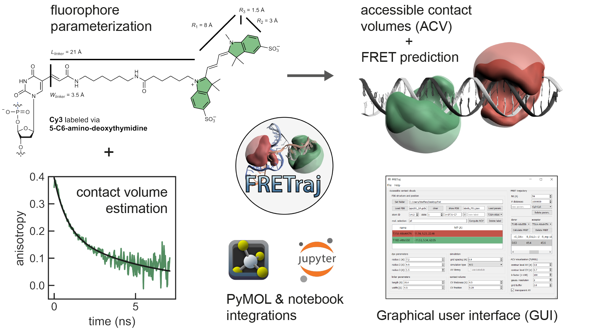
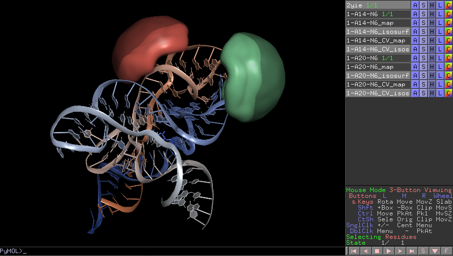
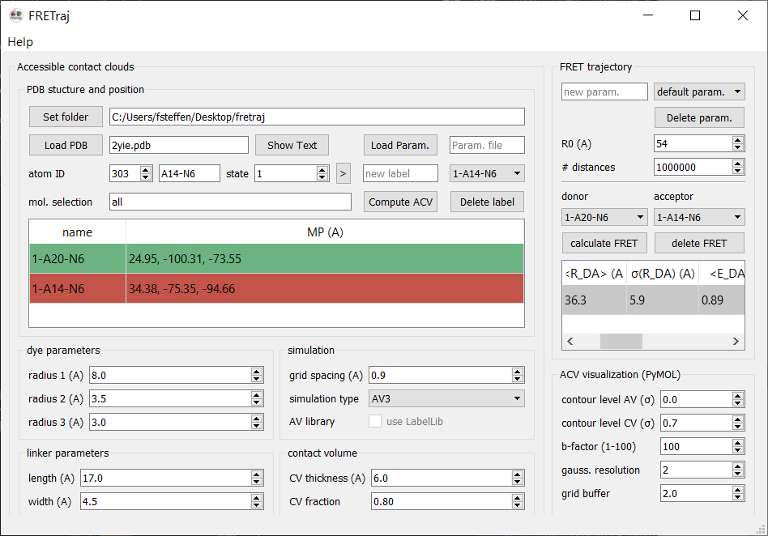

.. toctree::
   :maxdepth: 2

.. role:: raw-html(raw)
   :format: html

FRETraj - Predicting FRET *in silico* 
=====================================

FRETraj is a high-level Python API to the **LabelLib** library (https://github.com/Fluorescence-Tools/LabelLib) to simulate fluorophores which are coupled to a biomolecule of interest. The package features a user-friendly **PyMOL plugin** which can be used to explore different labeling positions while designing new FRET experiments. In an AV simulation the fluorophore distribution is estimated by a shortest path search (Djikstra algorithm) using a coarse-grained dye probe. FRETraj further implements a **Python-only** version of the geometrical clash search used in LabelLib. This is particularly useful for trying out new features to improve the description of the dye distribution.

-----

Installation
************

FRETraj can be installed platform independently as a Python module or as a Plugin to PyMOL. If you would like to predict FRET efficiencies from a single PDB file (including multiple states), then the PyMOL Plugin provides you with the easiest and fastest access to FRETraj. If you like to integrate FRETraj in your Python analysis workflow (e.g. to calculate multiple accessible volumes along an molecular dynamics trajectory, hence the name), then install FRETraj as a module.

.. _pymol_plugin_installation:

PyMOL plugin
------------

You can get the latest version of PyMOL from `Schrödinger <https://pymol.org/>`_. Start the **Anaconda prompt** which comes bundled with PyMOL 2.x and install the necessary dependencies. ::

    conda install numpy "numba<=0.44" mdtraj packaging -c conda-forge

For a faster calculation of the AVs you may additionally install `LabelLib <https://github.com/Fluorescence-Tools/LabelLib>`_, but this is not required as FRETraj also runs its own implementation of the AV algorithm. ::

    conda install -c tpeulen labellib
    or 
    pip install git+https://github.com/fdsteffen/labellib.git@src-neighbour-nodes

To use the **FRETraj PyMOL plugin** simply download the .zip archive from Github and install it via PyMOL's Plugin manager: ``Plugin`` :raw-html:`&rarr;` ``Plugin manager`` :raw-html:`&rarr;` ``Install New Plugin`` :raw-html:`&rarr;` ``Choose file...`` and select the .zip archive. Upon first startup FRETraj will prompt you to select a root directory where to store the calculated ACVs and parameter files.

Install Python module from source
---------------------------------

Download and unpack the .zip archive from Github or clone the repository with ::

    git clone https://github.com/fdsteffen/fretraj.git

Using *conda* create a new environment from the `fretraj.yml` file and activate it ::

  conda env create -f fretraj.yml
  conda activate fret-env

Finally install FRETraj into the new environment ::

  pip install .

-----

Getting started
***************

.. role::  raw-html(raw)
    :format: html

Want to predict FRET on a single PDB structure?
-----------------------------------------------

:raw-html:`&rarr;` Have a look at the step-by-step :doc:`PyMOL tutorial <pymol_plugin>`

Would you rather interact programmatically with FRETraj?
--------------------------------------------------------

A good way to start is to visit one of the :doc:`tutorials <tutorial/single/accessible_contact_volume>`

-----

Reference
*********

.. |Steffen2016| image:: https://img.shields.io/badge/DOI-10.1039/C6CP04277E-blue.svg
  :target: https://doi.org/10.1039/C6CP04277E

If you use FRETraj in your work please refer to the following paper:
 F.D. Steffen, R.K.O. Sigel, R. Börner, *Phys. Chem. Chem. Phys.* **2016**, *18*, 29045-29055. 
 |Steffen2016|

For more information see a list of :doc:`related projects <references>`.